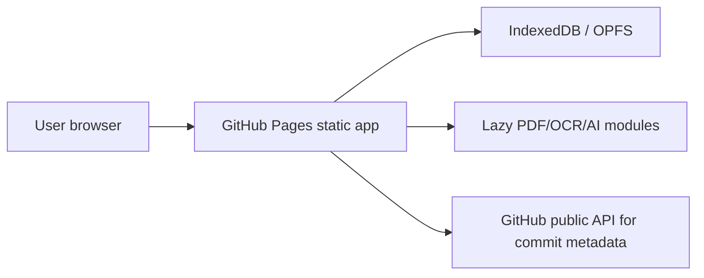

# PDF Workbench


Live site: https://baditaflorin.github.io/pdf-workbench/

Repository: https://github.com/baditaflorin/pdf-workbench

Support: https://www.paypal.com/paypalme/florinbadita

PDF Workbench is a privacy-first browser PDF toolkit for editing, OCR, forms, conversion, and signing without an Acrobat subscription.


## Features

- Open PDFs locally in the browser; no upload path.
- Reorder, rotate, delete, and export pages.
- Fill detected AcroForm text, checkbox, dropdown, option list, and radio fields.
- Add text stamps and visible signature appearances.
- Extract embedded text, OCR rendered pages with Tesseract.js, and export TXT/Markdown/HTML.
- Show version, latest public GitHub commit, repository link, and PayPal support link in the app.

## Quickstart

```bash
npm install
make install-hooks
make dev
make build
make smoke
```

## Architecture



Mode A keeps every PDF local to the browser. There is no runtime backend and no document upload path.

## Docs

Architecture: docs/architecture.md

Deployment: docs/deploy.md

Privacy: docs/privacy.md

ADRs: docs/adr/

Postmortem: docs/postmortem.md
