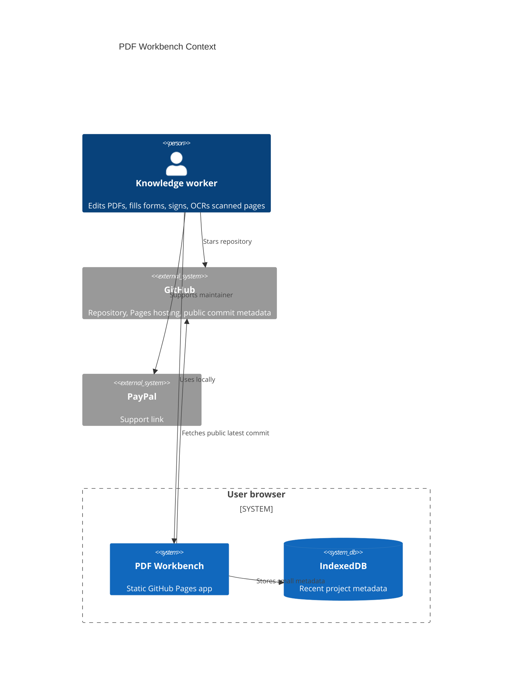
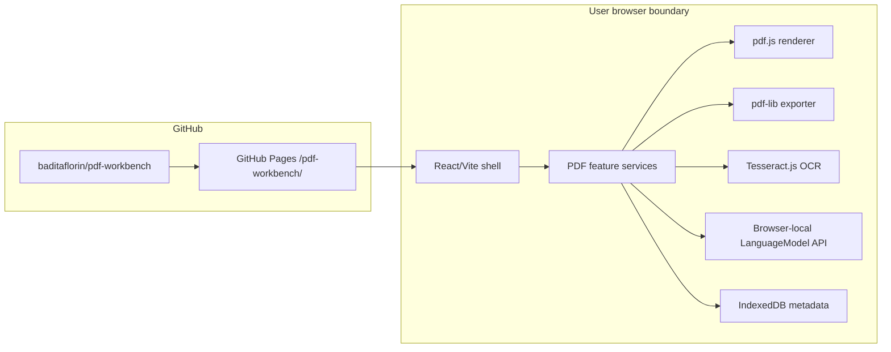

# Architecture

Live site: https://baditaflorin.github.io/pdf-workbench/

Repository: https://github.com/baditaflorin/pdf-workbench

## Context

## Container

## Module Boundaries

- `src/features/pdf/` owns document state, PDF parsing/export, OCR, forms, text stamping, signature appearance, and text conversion.
- `src/features/project/` owns public project metadata, GitHub commit display, repository link, and PayPal link.
- `src/lib/` owns browser storage, download helpers, and shared error utilities.
- `docs/` is generated Pages output and is committed intentionally.

There is no runtime backend in v1.
